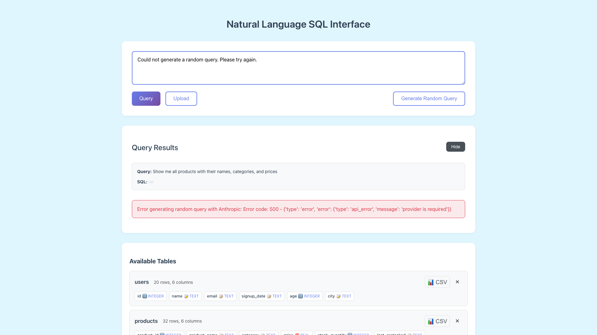

# Chart Visualization

**ADW ID:** 40
**Date:** 2026-05-28
**Specification:** specs/issue-4865d694-adw-40-chart-visualization.md

## Overview

A chart visualization feature was added to the Natural Language SQL Interface, allowing users to render query results as interactive bar, line, or pie charts using Chart.js. The feature intelligently categorizes columns by data type, auto-selects sensible defaults, and ensures all chart values are properly parsed as numbers.

## Screenshots

## What Was Built

- Chart.js integration for client-side chart rendering
- Visualize button that appears next to Export button (hidden when 0 rows)
- Chart configuration modal with type selector and axis dropdowns
- Intelligent column type detection (numeric vs categorical)
- Auto-selection of default columns for X and Y axes
- Pie chart with 15-slice limit and "Other" grouping
- Full tooltip support with percentage labels for pie charts
- Minimum 300px chart height for readability

## Technical Implementation

### Files Modified

- `app/client/package.json`: Added Chart.js ^4.4.0 dependency
- `app/client/src/main.ts`: Added chart visualization logic and UI components
- `app/client/src/style.css`: Added styles for visualize button and chart modal

### Key Changes

- Registered Chart.js components (CategoryScale, LinearScale, BarElement, LineElement, ArcElement, etc.)
- Added global state tracking for currentResults and currentColumns
- Created helper functions: `isNumericColumn()`, `getDefaultChartColumns()`, `parseNumericValue()`, `prepareChartData()`
- Implemented `showVisualizeModal()` for chart configuration UI
- Implemented `generateChart()` with proper Chart.js configuration
- Added visual styling for the visualize button and chart modal

## How to Use

1. Execute a query that returns results with at least one numeric column
2. A "Visualize" button (chart emoji) appears in the results header
3. Click the Visualize button to open the chart configuration modal
4. Select a chart type: Bar, Line, or Pie
5. Choose an X-axis column (categorical/text columns only)
6. Choose a Y-axis column (numeric columns only)
7. Click "Generate Chart" or the chart auto-generates with defaults
8. Hover over chart elements to see tooltips with exact values

## Configuration

No additional configuration required. The feature:
- Auto-selects the first text column for X-axis (excluding id/rowid)
- Auto-selects the first numeric column for Y-axis (excluding id/rowid)
- Parses all Y-axis values as numbers before charting
- Limits pie charts to 15 slices with remainder grouped as "Other"

## Testing

- Run `cd app/client && bun tsc --noEmit` to validate TypeScript compilation
- Run `cd app/client && bun run build` to validate the build succeeds
- E2E tests are available in `.claude/commands/e2e/test_chart_visualization.md`

## Notes

- Chart.js v4.4.0 provides good TypeScript support
- Chart rendering is entirely client-side using existing query results data
- The Visualize button is hidden when query results have 0 rows
- If no numeric columns exist, an error message is shown instead of an empty chart