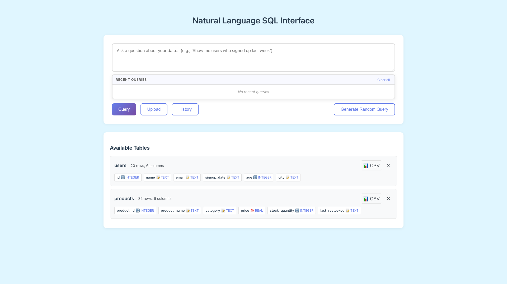
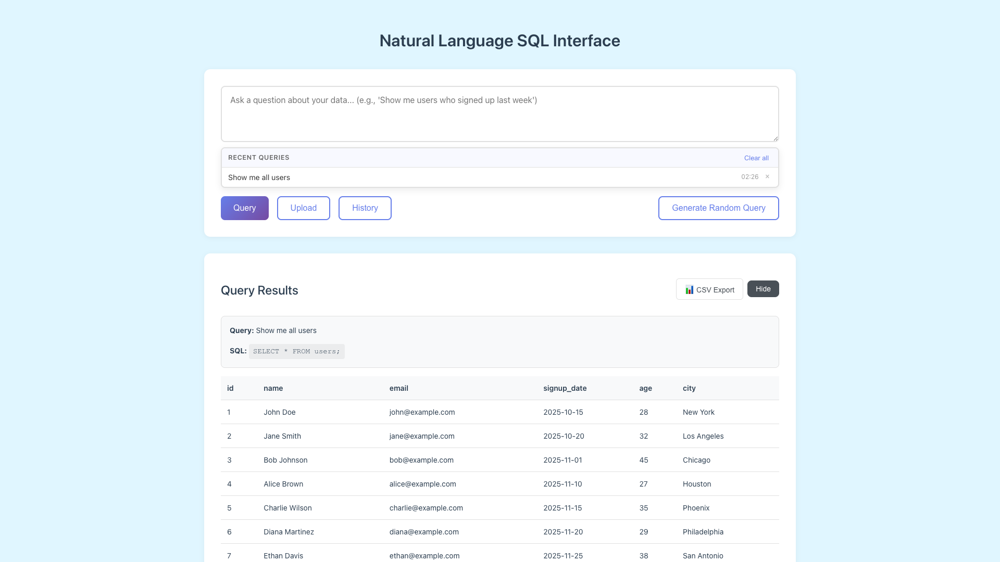
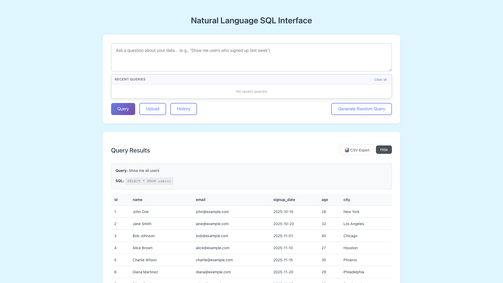

# Query History

**ADW ID:** 14
**Date:** 2026-03-27
**Specification:** specs/issue-90f63f51-adw-14-sdlc_planner-query-history.md

## Overview

Query History adds a persistent, localStorage-backed record of the last 20 successfully executed queries. A "History" toggle button below the query input opens a dropdown panel listing recent queries in reverse-chronological order, allowing users to re-run or iterate on previous queries without retyping them.

## Screenshots







## What Was Built

- localStorage-backed query history with a 20-entry cap
- "History" toggle button in the query controls bar (uses `.secondary-button` class)
- Dropdown panel listing recent queries in reverse-chronological order
- Click-to-rerun: clicking an entry populates the textarea and immediately executes the query
- Per-entry "×" remove button for individual entry deletion
- "Clear all" button to wipe the entire history list
- Empty state message ("No recent queries") when history is empty
- Deduplication: re-submitting the same query updates its timestamp rather than adding a duplicate
- Graceful degradation when localStorage is unavailable

## Technical Implementation

### Files Modified

- `app/client/src/main.ts`: Added localStorage helper functions, `renderHistoryList()`, `initializeQueryHistory()`, and hooked `addToHistory()` into the query success path
- `app/client/index.html`: Added "History" toggle button to `.query-controls-left` and `#history-dropdown` panel below the textarea
- `app/client/src/style.css`: Added CSS for dropdown panel, history entries, remove button, clear-all link, and empty state
- `app/client/src/types.d.ts`: Added `QueryHistoryEntry` TypeScript interface

### Key Changes

- **localStorage key:** `query_history` stores a JSON array of `QueryHistoryEntry` objects (`{ query, sql, timestamp }`)
- **`addToHistory(query, sql)`** is called immediately after `displayResults()` on successful queries; the `catch` block and `response.error` path do NOT call it, ensuring failed queries are never recorded
- **Deduplication** is handled by filtering out any existing entry with the same query string before prepending the new one
- **Dropdown re-renders** after every mutation (add, remove, clear) by calling `renderHistoryList()`, keeping UI in sync without a reactive framework
- **In-flow layout:** the dropdown is positioned in normal document flow (not absolute/fixed), avoiding z-index conflicts

## How to Use

1. Execute any natural-language query using the Query button.
2. After a successful result, click the **History** button (next to the Query button) to open the history dropdown.
3. Click any entry in the list to repopulate the query input and immediately re-run that query.
4. Click the **×** button on an entry to remove it from history.
5. Click **Clear all** to remove all history entries.
6. History persists across page refreshes automatically.

## Configuration

No configuration required. History is stored client-side in `localStorage` under the key `query_history`. Maximum 20 entries; the oldest entry is dropped when the 21st entry is added.

## Testing

Run the E2E test suite for query history:

```bash
# From the project root, invoke the E2E test
# See .claude/commands/e2e/test_query_history.md for the full test steps
```

The test validates:
- Dropdown visibility toggle
- Entry added after successful query
- Click-to-rerun behavior
- Individual entry removal
- Clear all functionality
- Empty state message
- Persistence across page refresh

## Notes

- Client-only feature — no server changes required.
- History is not recorded for failed queries (network errors or `response.error` responses).
- If localStorage is unavailable (e.g., restricted private browsing), the feature degrades gracefully: the UI renders with an empty list each session.
- No new npm/bun packages were added.
