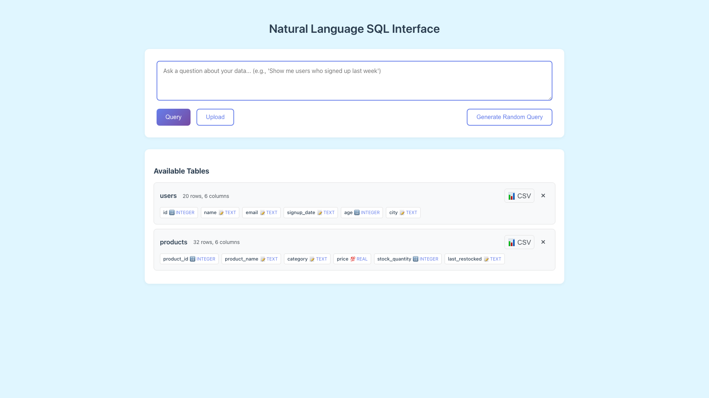
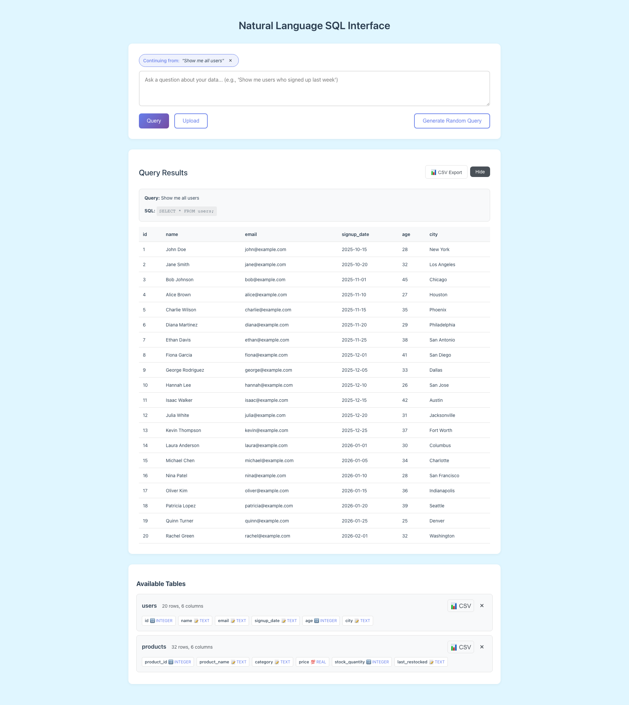
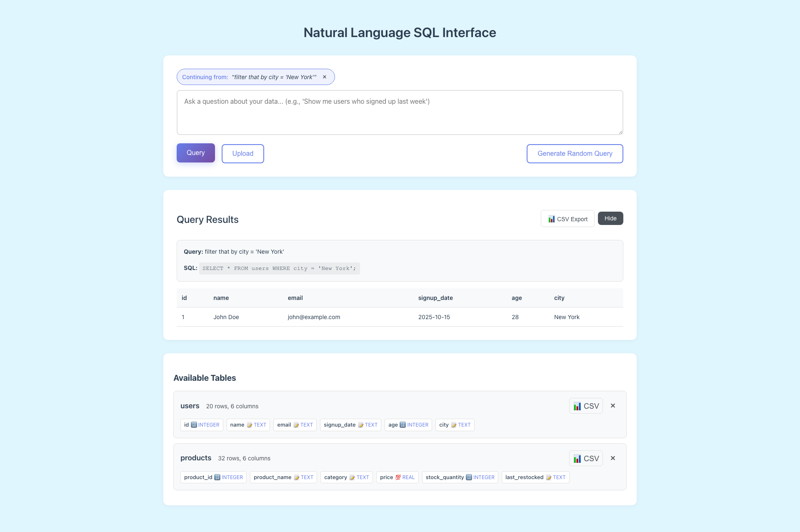
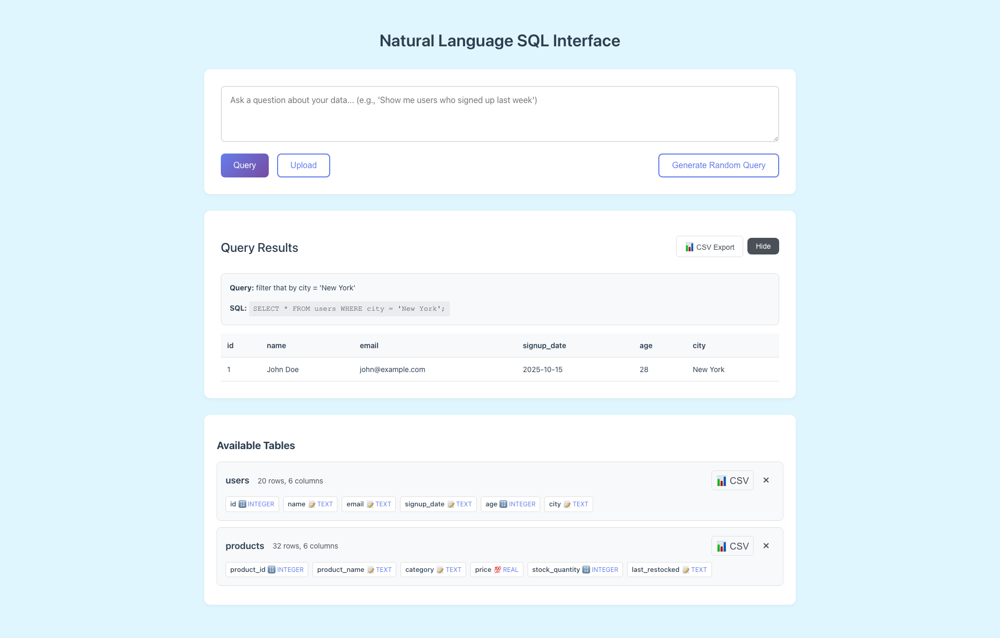

# Conversational Follow-ups

**ADW ID:** d5bcc5c6
**Date:** 2026-05-28
**Specification:** specs/issue-d5bcc5c6-adw-d5bcc5c6-sdlc_planner-conversational-follow-ups.md

## Overview

Adds single-turn conversational context to the Natural Language SQL Interface. After a successful query, the previous natural language question and its generated SQL are carried forward as context with the next request, so users can write follow-ups like "now filter that by city" or "show that as percentages" without restating the table or original question. A "Continuing from: '<previous query>'" pill above the input makes the active context visible, and a "×" clear button (plus file upload, plus failed queries) returns the input to standalone mode.

## Screenshots









## What Was Built

- Optional `previous_query` and `previous_sql` fields on the server `QueryRequest` contract
- A `format_previous_turn(...)` helper that renders a "Previous turn" block into the LLM prompt only when both fields are present and non-empty
- OpenAI and Anthropic prompt builders threaded with the previous-turn context, plus router forwarding through `generate_sql(...)`
- Client-side module-scope state for the last `(query, sql)` pair, with helper `setContext(...)` controlling the UI
- "Continuing from" pill markup, styling, and an inline "×" clear-context button above the query input
- Auto-clear of context on file upload and on app startup (failed queries leave the prior context intact)
- Unit tests for prompt construction (both providers), router forwarding, and the standalone-prompt regression path
- SQL-injection regression test proving `previous_sql` is inert (never executed, never concatenated into the executed SQL)
- New Playwright E2E test (`test_conversational_followups.md`) covering the full loop end-to-end with screenshots

## Technical Implementation

### Files Modified

- `app/server/core/data_models.py`: Added two optional fields to `QueryRequest` — `previous_query` and `previous_sql` — both defaulting to `None`
- `app/server/core/llm_processor.py`: Added `format_previous_turn(...)` helper; extended `generate_sql_with_openai`, `generate_sql_with_anthropic`, and the `generate_sql(...)` router to accept and forward previous-turn context
- `app/server/tests/core/test_llm_processor.py`: Added tests for "Previous turn" block presence/absence across providers, router forwarding, and standalone-prompt regression
- `app/server/tests/test_sql_injection.py`: Added `test_previous_sql_field_is_inert` to confirm a malicious `previous_sql` value cannot reach SQL execution
- `app/client/src/types.d.ts`: Added `previous_query?: string` and `previous_sql?: string` to `QueryRequest`
- `app/client/index.html`: Added the `#context-pill` markup (label + query span + clear button) above the textarea, hidden by default
- `app/client/src/style.css`: Added `.context-pill`, `.context-pill-label`, `.context-pill-query`, and `.clear-context-button` rules reusing existing CSS variables
- `app/client/src/main.ts`: Added module-scope `previousQuery` / `previousSql` state, the `setContext(...)` helper, `initializeClearContextButton()`, and wired follow-up context into `executeQuery` and `handleFileUpload`
- `.claude/commands/e2e/test_conversational_followups.md`: New E2E test exercising the full follow-up loop with screenshots

### Key Changes

- **Single-turn by design.** Only the most recent successful `(query, sql)` pair is carried forward — no transcript, no multi-turn memory. Forward-compatible with a future `history: list[TurnContext]` extension.
- **Prompt block is conditional.** `format_previous_turn(...)` returns an empty string when either field is missing or blank, so the standalone prompt path is byte-for-byte unchanged (regression-protected by tests).
- **Failures don't poison context.** `setContext(query, response.sql)` is called only in the success branch (no `response.error`, `response.sql` non-empty). Failed queries leave the prior pair intact.
- **`previous_sql` is treated as untrusted text.** It is inlined into the LLM prompt but never executed and never concatenated into the SQL string. The LLM's new SQL still passes through the existing `validate_sql_query` pipeline.
- **UI truncation.** Long previous queries are truncated to 80 chars with an ellipsis inside the pill to keep the layout stable.

## How to Use

1. Open the app and upload (or select) a dataset.
2. Enter a natural-language query (e.g. `Show me all users`) and click **Query**.
3. After the results render, the "Continuing from: '<previous query>'" pill appears above the input.
4. Enter a follow-up that references the prior turn (e.g. `filter that by city`, `now group it by month`, `show that as percentages`) and click **Query**. The generated SQL will reference the previous table/columns without you restating them.
5. To return to standalone mode, click the **×** on the pill. The pill disappears and the next query is sent without context.
6. Uploading a new CSV/JSON/JSONL file also clears the context automatically.

## Configuration

No new configuration, environment variables, or dependencies. Existing `OPENAI_API_KEY` / `ANTHROPIC_API_KEY` provider selection is unchanged.

## Testing

### Unit Tests

```bash
cd app/server && uv run pytest tests/core/test_llm_processor.py -v
cd app/server && uv run pytest tests/test_sql_injection.py -v
cd app/server && uv run pytest -v
```

### Client Build / Type-check

```bash
cd app/client && bun tsc --noEmit
cd app/client && bun run build
```

### E2E

Run the Playwright test described in `.claude/commands/e2e/test_conversational_followups.md`. It exercises the full loop: empty state → query → pill appears → follow-up references prior table → clear context → pill hidden.

### Manual

1. Run "show me all users" against the Users sample — pill appears.
2. Run "filter that by city = 'New York'" — second SQL references `users` without restating it.
3. Click **×** on the pill — pill disappears, next query is standalone.
4. Trigger a failed query — prior successful context is preserved.
5. Upload a new dataset — pill disappears.

## Notes

- **Cost.** Including the previous turn adds roughly 50–150 tokens to each follow-up prompt — acceptable for single-turn carry. Multi-turn would warrant truncation or summarization.
- **Why send `previous_sql` and not just `previous_query`?** The SQL is the most concrete grounding signal — it disambiguates tables, joins, projections, and filter columns that natural language alone leaves ambiguous.
- **Privacy / safety.** `previous_sql` is plain prompt text only; it is never executed and never concatenated into an executed SQL string. New LLM output still flows through `validate_sql_query`.
- **Edge case — empty string for one field.** The prompt builder treats this as "no context" defensively. The client should never send this, but the server guards it.
- **Future extension hook.** `history: list[TurnContext]` can be added later without breaking clients still sending `previous_query` / `previous_sql`.
